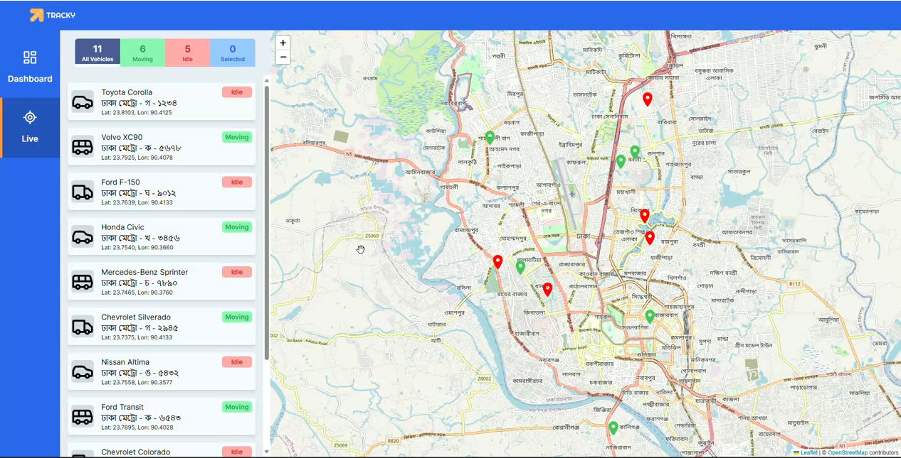
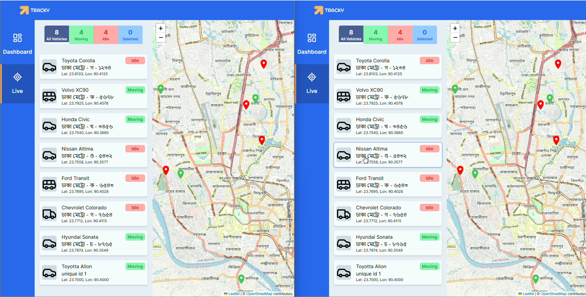
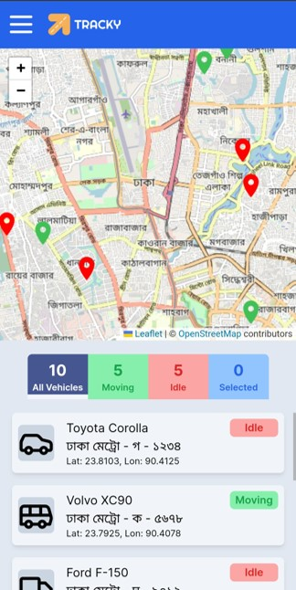
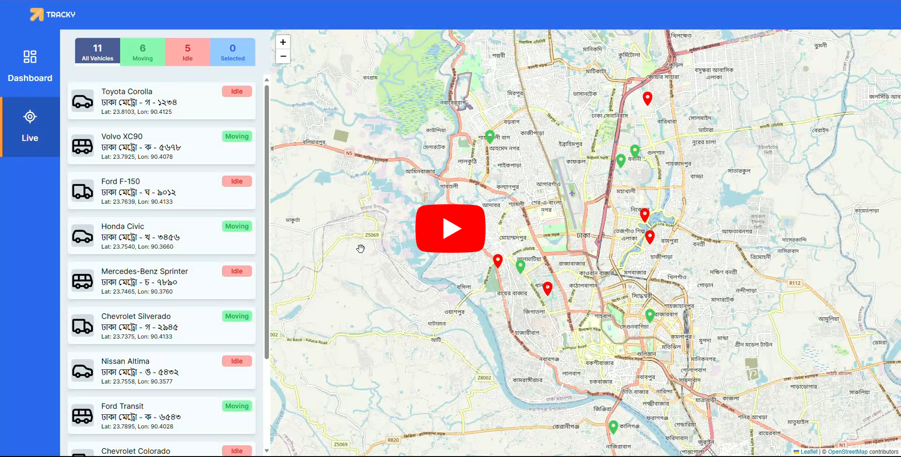

<div align='center'><h1>Mini Vehicle Tracking Dashboard</h1></div>

<table>
<tr>
<td align='center'>Multi Client</td>
<td align='center'>Mobile View</td>
</tr>
<tr>
<td></td>
<td></td>
</tr>
</table>

<div align='center'><h3><a href="https://vehicle-tracking-rush1dan.vercel.app" target="_blank">View Live Demo</a></h3></div>

## About
This is a full stack vehicle tracking/fleet management app with realtime communication and updates between multiple clients and the server. This app has been built with completely free map tools. It uses **Leaflet.js** as the map library with **Open Street Maps** for the map tiles and **Nominatim** api for Geocoding and Reverse Geocoding locations.

## Dev

First, run the development servers for the server and client apps:

For the server app, cd into the server directory and:
```bash
node index.js
```
For the client app, cd into the client directory and:
```bash
npm run dev
# or
yarn dev
# or
pnpm dev
```

Open [http://localhost:3000](http://localhost:3000) with your browser to see the result.

Duplicate the browser tab to see realtime syncing between server and multiple client instances.

## Demo
[](https://youtu.be/OzAwv9xKoU4)

## Built With
<div>
<h4>Front End:</h4>

<div>


</div>

<h4>Back End:</h4>

<div>


</div>

</div>
